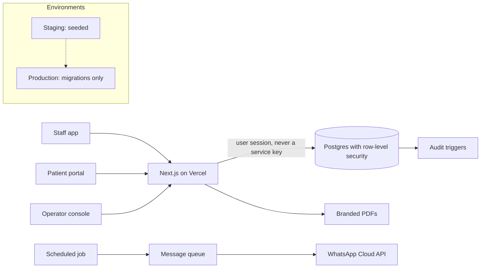
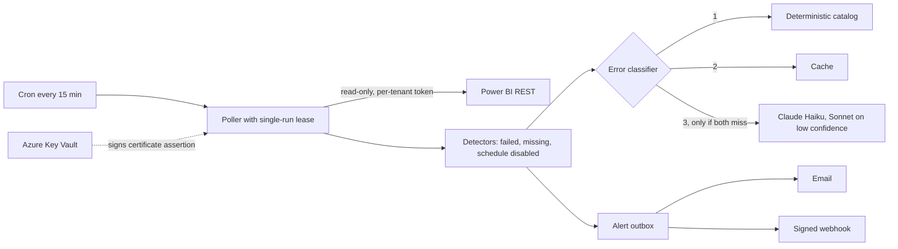
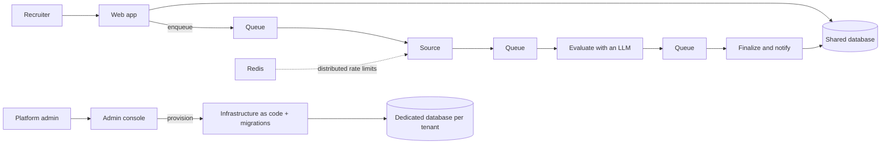
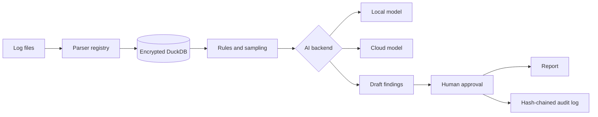

# Alvaro "Pau" Reis

**AI engineer. I build multi-tenant products end to end, and I use AI agents to assist my development without lowering the bar.**

Broward County, Florida · open to full-time roles and selected freelance work

  

Also in daily use: Claude (API and Claude Code), Codex, Playwright, pgTAP, mutation testing, Stripe, DuckDB, Ollama.

---

## What I'm working on now

*Updated October 2026.*

- **MiConsultorio**: clinic management for medical and dental practices in Venezuela. In production, pre-launch.
- **RefreshRadar**: monitoring for Power BI refreshes. Live at [refreshradar.com](https://refreshradar.com).
- **Talent Scout Pro**: a multi-tenant recruiting platform in production with two healthcare organizations.
- **[pau-skills](https://github.com/paureis/pau-skills)**: the Claude Code skills, hooks and scripts I use every day, packaged as a plugin marketplace so others can reap the benefits as well.
- **PauPortfolio**: my portfolio site, a closer look at my work and what I do off the clock. *Coming soon.*

---

## Featured work

Most of what I build lives in private repositories, so here is what's inside them. Open any project for its architecture diagram and engineering notes.

### MiConsultorio · clinic management

Scheduling, patient records with clinical history and odontogram, billing in two currencies, inventory, memberships, WhatsApp reminders, a patient portal and an audit trail, for small practices that today run on paper and chat messages. I am the sole engineer; a partner leads the commercial side.

**Stack:** Next.js 16 (App Router) · TypeScript · Tailwind v4 · Supabase (Postgres 17, Auth, Storage) · Vercel · Vitest · Playwright

<b>Architecture and engineering notes</b>

- **Access rules live in the database.** Row-level security decides which rows each role sees, the server decides modules and amounts, and the client only renders. Every new rule ships with a test that signs in as each role.
- **Two-factor is enforced in the database too**, not only in the UI, with a guided setup that always ends in backup codes.
- **261 end-to-end tests run from a freshly seeded database** on every pull request, next to unit and row-level-security suites. A flaky test is treated as a defect.
- **Staging and production are separate projects**; migrations are additive and reach staging before a merge.

### RefreshRadar · Power BI refresh monitoring

Catches failed, missed and silently disabled dataset refreshes, explains the error in plain language and alerts by email or webhook. Self-serve, with Stripe subscriptions. Live at [refreshradar.com](https://refreshradar.com).

**Stack:** Next.js 16 · TypeScript · Supabase Postgres (forced RLS) · Microsoft Entra ID · Azure Key Vault · Stripe · Resend · Vercel Cron · Claude through Vercel AI Gateway

<b>Architecture and engineering notes</b>

- **The LLM is the last resort.** A deterministic catalog answers first, then a cache; a model is called only when both miss, behind an interface so the whole suite runs with no network and no key.
- **No client secret anywhere.** Tenants are reached with a certificate assertion whose private key never leaves Key Vault.
- **The architecture document cannot go stale.** A test fails CI if the architecture manifest and the code disagree, in either direction.
- **About 1,700 unit, 300 integration and 129 database tests**, plus eight custom static gates (for example: privileged database imports only from one layer; the cron schedule in config must equal the constant in code).

### Talent Scout Pro · multi-tenant recruiting platform

A B2B SaaS used in production by two healthcare organizations. I am the founder and sole engineer. Details of the product are deliberately brief here; the engineering side is definitely not.

**Stack:** Next.js 16 · TypeScript · Azure App Service · Azure Functions · Storage Queues · serverless Azure SQL · Key Vault · Redis · Entra ID SSO · Stripe · Claude

<b>Architecture and engineering notes</b>

- **Tenant isolation with an upgrade path**: a shared database by default and a dedicated one per corporate customer, provisioned automatically from the admin console.
- **A queue-driven pipeline** so slow external calls and model evaluation scale independently, with distributed rate limiting to respect third-party quotas.
- **Cost is engineered, not assumed**: token cost is recorded per call, and a billing regression in a serverless database was diagnosed from the invoice and fixed with budget alerts added.
- **Separate staging and production pipelines**, about 590 tests, and a strict content security policy.

### Desktop log-analysis workbench · Rust

An offline-first desktop tool for database consultants: it ingests SQL Server diagnostic logs, stores them locally and drafts findings that a person approves before anything is delivered.

**Stack:** Tauri v2 · Rust · React · TypeScript · DuckDB · Ollama or Azure OpenAI

<b>Architecture and engineering notes</b>

- **Analysis can run fully offline** with a local model; cloud models are an optional upgrade behind one interface.
- **A tamper-evident audit log** (hash chain with an integrity verifier) for everything delivered to a client.
- **Encrypted at rest with the key in the operating system keystore**, tested on real Windows runners in CI. About 310 tests.

### Open source

- **[pau-skills](https://github.com/paureis/pau-skills)** · the Claude Code skills, hooks and scripts behind the process described below, as an installable plugin marketplace: 14 skills and 4 hooks, each marked original or adapted, with about 100 tests.
- **[BurnRate](https://github.com/paureis/BurnRate)** · a local-first subscription tracker with no backend, no account and no API key. Share pages, the preview image and a live calendar feed are rendered purely from the URL. Includes a dependency-free QR encoder and about 530 tests. [Live demo](https://burnrate-bay.vercel.app).

---

Most of my commits are in private repositories, so the contribution graph is the best public trace of what I am working on day to day.
